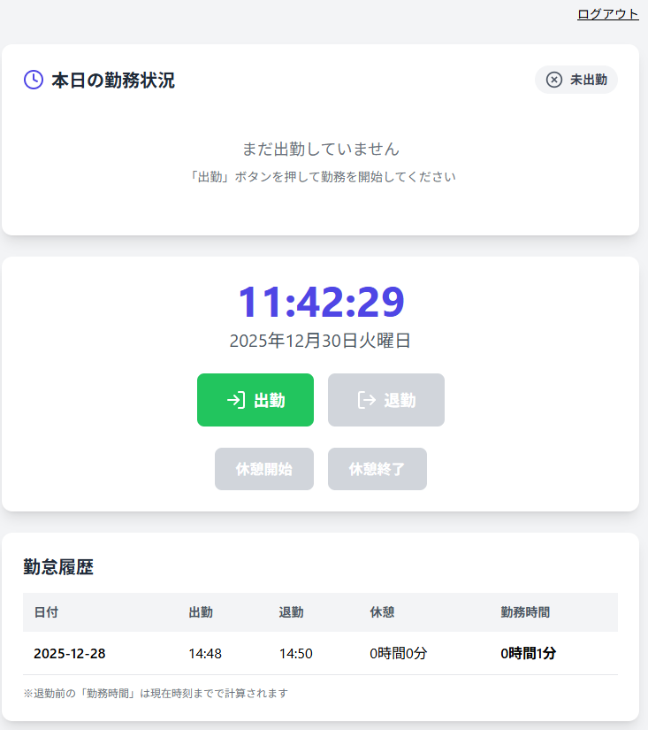
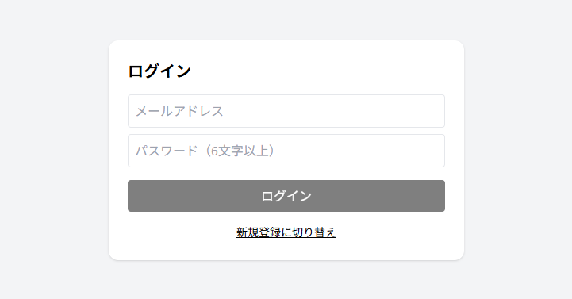
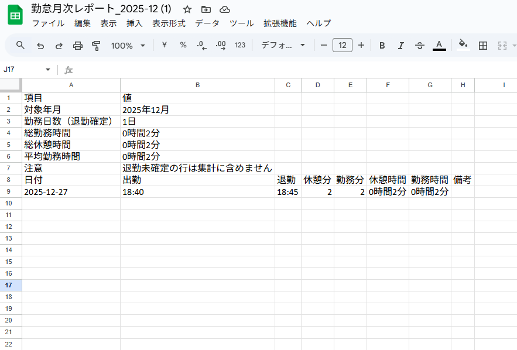

# Attendance Management App
React + TypeScript + Firebase を用いた勤怠管理Webアプリ

開発背景：日々の勤怠管理をシンプルに行えるよう、
React と Firebase を用いた実用的なWebアプリとして開発しました。

## Demo
https://attendance-management-zl2n.onrender.com

## 概要
React + TypeScript + Firebase で作成した勤怠管理アプリです。
（出勤・退勤・休憩管理、勤怠履歴、月次レポートのExcel出力）

## アプリ説明
出勤・退勤・休憩をワンクリックで記録でき、
日付ごとの勤怠情報を Firestore に保存します。

## 主な機能
- 出勤 / 退勤の打刻
- 休憩開始 / 終了
- 日付ごとの勤怠履歴表示
- 月次レポートのエクスポート（Excel）
- Firestore とのデータ同期
- ローカル日付（JST）対応

## 使用技術
- React
- TypeScript
- Firebase (Firestore)
- Tailwind CSS

## 工夫した点
- Firestore / localStorage / state の同期を整理
- UTC と JST のズレによる日付バグを修正
- 日付キーをローカル日付で統一

## セットアップ
```bash
npm install
npm run dev
```

## 📸 スクリーンショット

### トップ画面


### 勤怠履歴


### 月次レポート（Excel出力）

※ 画面はローカル開発環境での表示です。

